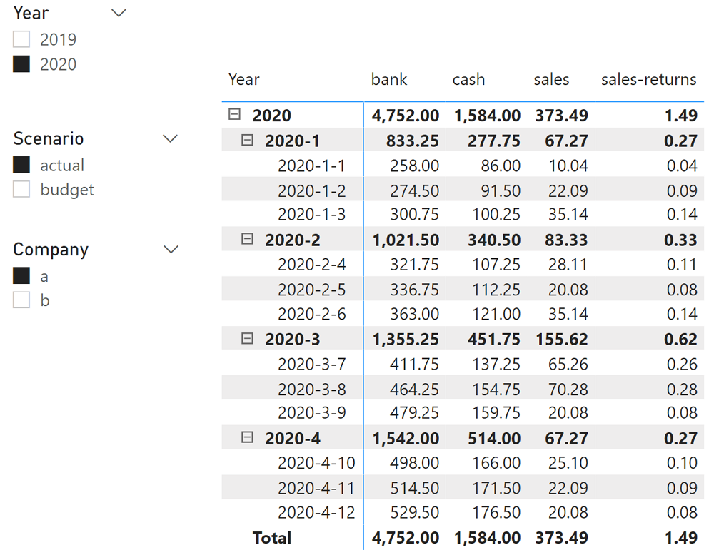
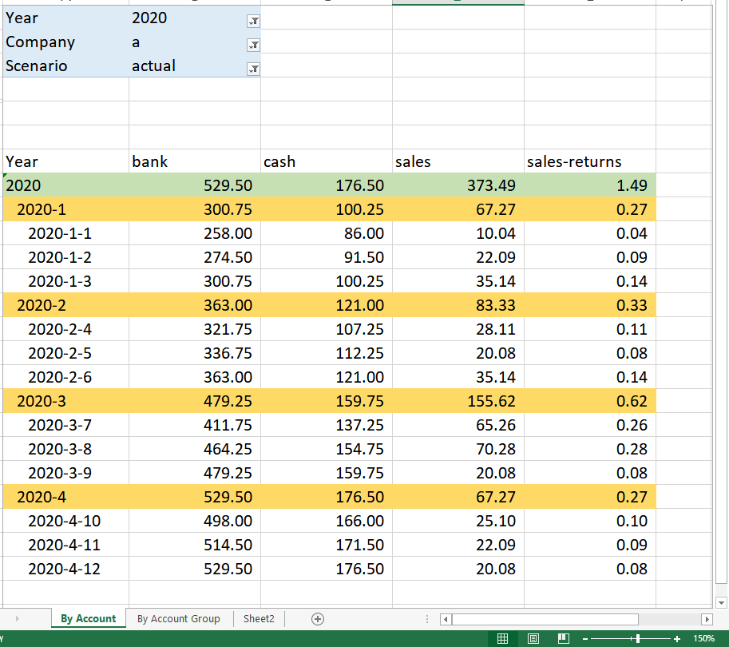
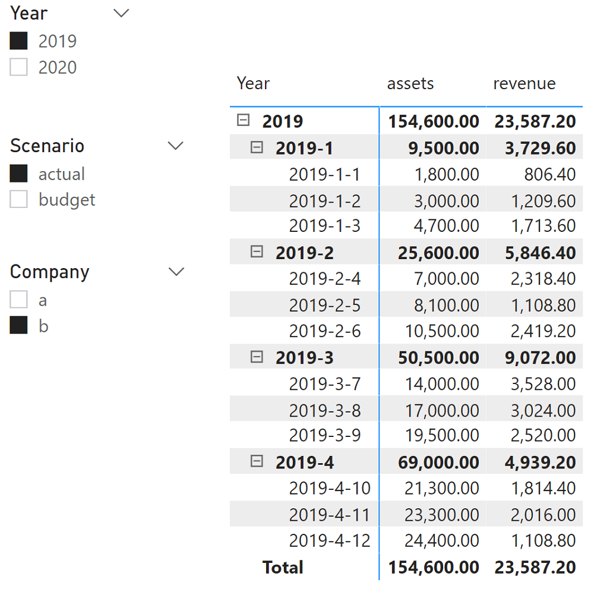
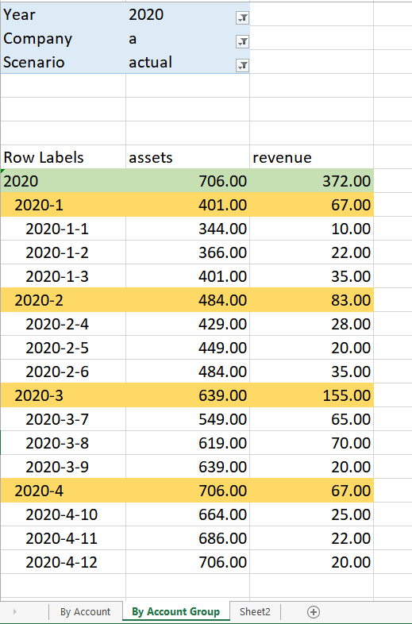

# Measure development objective

## [Amount Total]

* For balance account, it would aggregate semi-additively and for flow account, it would aggregate normally.
* At account group level, it would rollup the account's amount as per the above mentioned equation.

# File datails

* ajit-semi-additive-measures.pbix
* ajit-semi-additive-measures.xlsx (Not needed, data source file, data already transformed and loaded in pbix file)

# Data Details

Single table "Balance" containing the below columns:

* Company
  * two companies, "a" and "b"

* Account Group and Account
  * Two account groups
    * "assets"
    * "revenue"
  * Four accounts
    * bank
    * cash
    * sales
    * sales-returns
  * rollup of accounts to account group
    * "assets" group
      * "cash" plus "bank" accounts
    * "revenue" group
      * "sales" minus "sales-returns" accounts

* BalanceFlowSign

  * "1" - balance account

    balance account are semi-additive across month-qtr-year hiearchy. For quarter "2020-1", the last month of the quarter "2020-1-3" would be the balance

  * "2" - flow account

    for flow account, the amounts can be aggregated normally across month-qtr-year hiearchy.

# Sample reports for data validation

## By Account report

**[Amount Total] - Measure development pending**

**[Amount Total] Expected report** 

## By Account Group report

**[Amount Total] - Measure development pending**

**[Amount Total] Expected report** 

